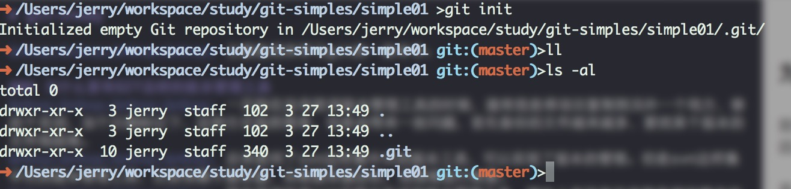
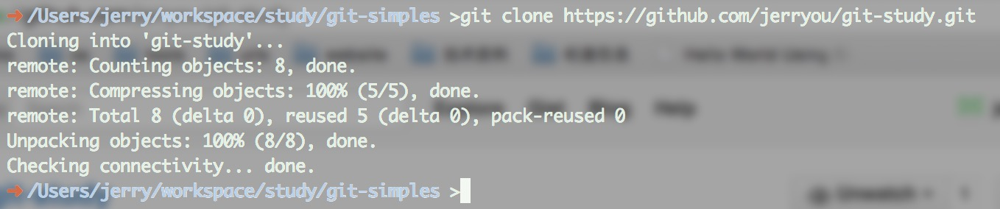
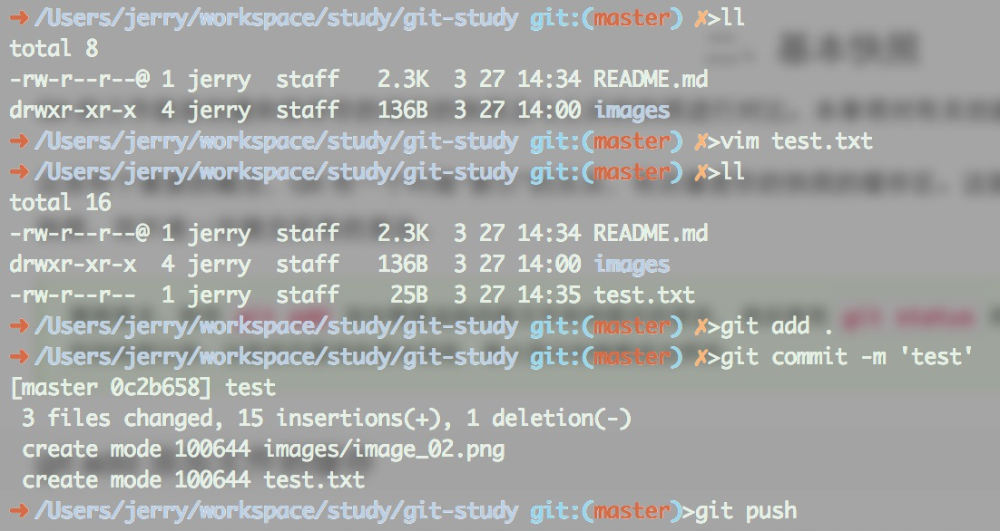

# git-study

&nbsp;&nbsp;&nbsp;&nbsp; 主要是用来学习git的一些命令。

### 为什么要有GIT这样的版本管理工具
&nbsp;&nbsp;&nbsp;&nbsp; 一开始在没有使用版本管理工具的时候，通常我是将项目复制到另外一个地方，修改个名词，加个日期标记下，这种方式虽然简单，但是会带来一些问题，首先备份的文件越来越多，要找某个版本的文件很困难。  
&nbsp;&nbsp;&nbsp;&nbsp; 后来使用了svn这样集中式的版本工具，可以实现了版本的管理。但是svn这样集中式的版本管理工具，比较依赖于服务器，如果服务器宕机，则很难进行恢复。  
&nbsp;&nbsp;&nbsp;&nbsp; 现在采用的是git这样分布式的版本管理工具，理论上来说是没有服务器的概念的（但是建议用一台机器作为服务器）。户端并不只提取最新版本的文件快照，而是把代码仓库完整地镜像下来。这么一来，任何一处协同工作用的服务器发生故障，事后都可以用任何一个镜像出来的本地仓库恢复。

### GIT安装配置
&nbsp;&nbsp;&nbsp;&nbsp; 安装方式很简单。可以到官方查看[安装](http://git.oschina.net/progit/1-%E8%B5%B7%E6%AD%A5.html#1.4-%E5%AE%89%E8%A3%85-Git)方法。  
&nbsp;&nbsp;&nbsp;&nbsp; 配置本地用户和邮箱
> 用户名邮箱作用 : 我们需要设置一个用户名 和 邮箱, 这是用来上传本地仓库到GitHub中, 在GitHub中显示代码上传者。  
> 使用命令 :   
> 	
	git config --global user.name "name" //设置用户名 
	git config --global user.email "email" //设置邮箱

### 获取Git仓库
&nbsp;&nbsp;&nbsp;&nbsp; 如果要想使用git，首先要拥有一个git仓库，这样才能让Git去管理这个仓库

1. 使用 git init 命令初始化一个仓库
		
		mkdir simple01
		cd simple01
		git init

	
	
2. git clone 复制一个 Git 仓库			
	
	  

	这样当前文件下就有一个 git-study 目录了，这个就是复制出来的git仓库。
	
	
### 一次基本的操作流程
&nbsp;&nbsp;&nbsp;&nbsp; 在开发过程中，我们要进行的操作就是：更新仓库，提交代码。
下面我们就来执行下这样的操作。 
 

1. 创建一个文件  
		
		vim test.txt
		
	录入内容：这是一个测试文件	
	
2. 添加缓存(索引)
		
		git add .
		
	执行这个命令之后，就可以使用git来管理我新创建的文件了。
	
3. 添加到本地仓库			

		git commit -m 'test'

4. 提交到远程仓库

		git push	

	
		