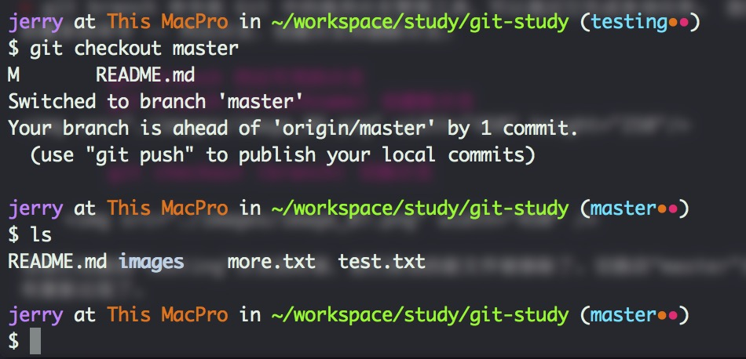

# git-study

&nbsp;&nbsp;&nbsp;&nbsp; 主要是用来学习git的一些命令。

### 为什么要有GIT这样的版本管理工具
&nbsp;&nbsp;&nbsp;&nbsp; 一开始在没有使用版本管理工具的时候，通常我是将项目复制到另外一个地方，修改个名词，加个日期标记下，这种方式虽然简单，但是会带来一些问题，首先备份的文件越来越多，要找某个版本的文件很困难。  
&nbsp;&nbsp;&nbsp;&nbsp; 后来使用了svn这样集中式的版本工具，可以实现了版本的管理。但是svn这样集中式的版本管理工具，比较依赖于服务器，如果服务器宕机，则很难进行恢复。  
&nbsp;&nbsp;&nbsp;&nbsp; 现在采用的是git这样分布式的版本管理工具，理论上来说是没有服务器的概念的（但是建议用一台机器作为服务器）。户端并不只提取最新版本的文件快照，而是把代码仓库完整地镜像下来。这么一来，任何一处协同工作用的服务器发生故障，事后都可以用任何一个镜像出来的本地仓库恢复。

### GIT安装配置
&nbsp;&nbsp;&nbsp;&nbsp; 安装方式很简单。可以到官方查看[安装](http://git.oschina.net/progit/1-%E8%B5%B7%E6%AD%A5.html#1.4-%E5%AE%89%E8%A3%85-Git)方法。  
&nbsp;&nbsp;&nbsp;&nbsp; 配置本地用户和邮箱
> 用户名邮箱作用 : 我们需要设置一个用户名 和 邮箱, 这是用来上传本地仓库到GitHub中, 在GitHub中显示代码上传者。  
> 使用命令 :   
> 	
	git config --global user.name "name" //设置用户名 
	git config --global user.email "email" //设置邮箱

### 获取Git仓库
&nbsp;&nbsp;&nbsp;&nbsp; 如果要想使用git，首先要拥有一个git仓库，这样才能让Git去管理这个仓库

1. 使用 git init 命令初始化一个仓库
		
		mkdir simple01
		cd simple01
		git init

	
	
2. git clone 复制一个 Git 仓库			
	
	  

	这样当前文件下就有一个 git-study 目录了，这个就是复制出来的git仓库。
	
	
### 一次基本的操作流程
在开发过程中，我们要进行的操作就是：更新仓库，提交代码。
下面我们就来执行下这样的操作。 
&nbsp;&nbsp;&nbsp;&nbsp;  

1. 创建一个文件  
		
		vim test.txt
		
	录入内容：这是一个测试文件	
	
2. 添加缓存(索引)
		
		git add .
		
	执行这个命令之后，就可以使用git来管理我新创建的文件了。
	
3. 添加到本地仓库			

		git commit -m 'test'

4. 提交到远程仓库

		git push	

	
> ### *备注：*  

1. 如果是 git init 方式初始化的git仓库，想要提交到远程仓库上，首先必须得让本地仓库和远程仓库关联上。可以使用命令：git remote add [shortname] [url]   
		
		git remote add origin https://github.com/jerryou/git-study.git

2. 如果已经是纳入了git追踪的文件，不需要进行 git add 的，可以直接通过commit命令提交到本地仓库

3. 一个git管理有几个部分：工作空间、本地仓库、远程仓库	
> 1. 工作空间：就是本地存放文件的地方（一个目录/一个文件夹）、平时我们主要在这个工作空间下进行代码的编辑等操作
> 2. 本地仓库：相对于远程仓库的一个clone，可以通过 git commit 将文件提交到本地仓库。
> 3. 远程仓库：可以理解为git服务器，大家都从这个服务器上进行代码的clone，方便代码的管理。

4. .gitignore 忽略某些文件  
	一般我们总会有些文件无需纳入 Git 的管理，也不希望它们总出现在未跟踪文件列表。通常都是些自动生成的文件，比如日志文件，或者编译过程中创建的临时文件等。我们可以创建一个名为 .gitignore 的文件，列出要忽略的文件模式。如下：
	
		# 此为注释 – 将被 Git 忽略
    	# 忽略所有 .a 结尾的文件
    	*.a
    	# 但 lib.a 除外
    	!lib.a
    	# 仅仅忽略项目根目录下的 TODO 文件，不包括 subdir/TODO
    	/TODO
    	# 忽略 build/ 目录下的所有文件
    	build/
    	# 会忽略 doc/notes.txt 但不包括 doc/server/arch.txt
    	doc/*.txt
		

### git常用命令说明

1. git add 用来将文件纳入到版本控制     

		git add .  	-- 将当前目录以及子目录下没有纳入控制的文件纳入控制
		git add *.java -- 将当前目录以及子目录下没有纳入控制的.java文件纳入控制
		git add README.md -- 将README.md文件纳入版本控制
		
2. git commit 
		
		git commit -m '备注'  -- 提交到本地仓库，并进行备注,如果不启勇  -m 参数添加说明 会启动一个vim 让用户添加说明
		
3. git pull  从远程获取最新版本并merge到本地

		git pull
		
4. git push  提交到远程仓库

		git push

5. git fetch 	从远程获取最新版本到本地，不会自动merge 

		git fetch origin master
		git log -p master..origin/master
		git merge origin/master
		
6. git status 查看你的文件在工作目录与缓存的状态

		git status -s  -- 简短方式输出
		git status
		
	 

7. git diff 显示已写入缓存与已修改但尚未写入缓存的改动的区别

		git diff #尚未缓存的改动
		git diff –cached #查看已缓存的改动
		git diff HEAD #查看已缓存的与未缓存的所有改动
		git diff –stat #显示摘要而非整个 diff
		
	执行 git diff 来查看执行 git status 的结果的详细信息 —— 一行一行地显示这些文件是如何被修改或写入缓存的。		
	
8. git reset

		git reset HEAD 取消缓存已缓存的内容
		
9. git rm 将文件从缓存区移除  
	&nbsp;&nbsp;&nbsp;&nbsp;  git rm 会将条目从缓存区中移除。这与 git reset HEAD 将条目取消缓存是有区别的。 “取消缓存”的意思就是将缓存区恢复为我们做出修改之前的样子。 在另一方面，git rm 则将该文件彻底从缓存区踢出，因此它不再下一个提交快照之内，进而有效地删除它。  
	&nbsp;&nbsp;&nbsp;&nbsp;  默认情况下，git rm file 会将文件从缓存区和你的硬盘中（工作目录）删除。 如果要在工作目录中留着该文件，可以使用 git rm --cached
				
				
10. git log

		git log				
		commit 82c0f35b9763612a490810e9b4cc106a42eab121
		Author: Jerry2013 <jerry605948233@163.com>
		Date:   Sat Mar 28 22:07:42 2015 +0800

    		aaa

		commit d7c4a976a26f22526a2eb96c4c15681534b7eb61
		Author: Jerry2013 <jerry605948233@163.com>
		Date:   Sat Mar 28 21:56:59 2015 +0800

    		a

		commit e629b17eaa816bd34914204a69a6d6a46c965ef5
		Author: Jerry2013 <jerry605948233@163.com>
		Date:   Sat Mar 28 21:56:36 2015 +0800

		    aa

		commit 878ee6a4fe8da30d3daac55594188bb7befc142d
		Author: Jerry2013 <jerry605948233@163.com>
		Date:   Sat Mar 28 21:50:55 2015 +0800

		    git命令

		commit dd3841a9f313a2cc29e784271823756939b866dc
		Author: Jerry2013 <jerry605948233@163.com>
		Date:   Sat Mar 28 13:48:46 2015 +0800

    		命令
    		
	git log 会按提交时间列出所有的更新，最近的更新排在最上面。    
	
		git log -p -2
		
	  
	-p 选项展开显示每次提交的内容差异，用 -2 则仅显示最近的两次更新			
11. git tag  
	Git 可以对某一时间点上的版本打上标签。人们在发布某个软件版本（比如 v1.0 等等）的时候，经常这么做。
	
		git tag  #列显已有的标签
		git tag -a v0.1 -m 'my version 0.1'  #新建标签 －a 指定名称 －m 标签说明
		git show  ＃查看相应标签的版本信息，并连同显示打标签时的提交对象。
		
		
### 分支

git branch 列出、创建与管理工作上下文    git checkout 切换到新的分支上下文  

1. git branch		
> git branch 命令是 Git 中的通用分支管理工具，可以通过它完成多项任务。 我们先说你会用到的最多的命令 —— 列出分支、创建分支和删除分支。

		git branch 列出可用的分支
		git branch (branchname) 创建新分支
  

		git checkout (branch) 切换分支
		
	  				
当我们切换到“testing”分支的时候，我们添加的新文件被移除了。切换回“master”分支的时候，它们有重新出现了。  
  

		git checkout -b (branchname) 创建新分支，并立即切换到它
		相当于 git branch newbranch; git checkout newbranch
				
	如果要删除分支，可以使用 git branch -d (branchname) 删除分支  
	
	
2. git merge 将分支合并到你的当前分支	
> 一旦某分支有了独立内容，你终究会希望将它合并回到你的主分支。 你可以使用 git merge 命令将任何分支合并到当前分支中去。  
> 下面  我们首先建立了一个分支（rmtwofiles），并切换到这个分支，删除了2个文件
	  
	现在我们	希望合并 rmtwofiles 分支到主分支  
	   
	 

				
	